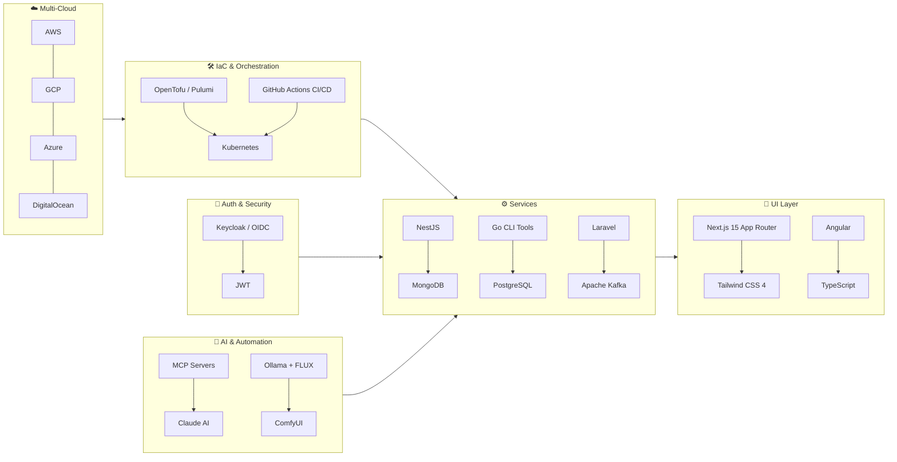
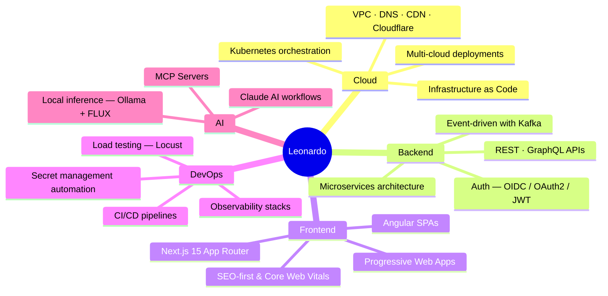

<!-- English · Português abaixo -->

# Leonardo Maia Costa

**Senior Fullstack Engineer · Cloud Architect · DevOps · 20+ Years in Production**

> **Turning complex distributed systems into reliable, scalable products — across AWS, GCP, Azure & DigitalOcean.**
>
> _Open to senior / staff remote positions worldwide_ 🌍

---

## 🏗️ Architecture at a Glance

---

## ⭐ Featured Open Source

| Project | Stack | What it does |
|---|---|---|
| [🔑 say-goodbye-to-your-local-env](https://github.com/lmaiacosta/say-goodbye-to-your-local-env) | `Go` · `GitHub Actions` | Interactive CLI that syncs `.env` files to GitHub Secrets — no more lazy scripts |
| [📊 auth-and-load-testing-example-microservices](https://github.com/lmaiacosta/auth-and-load-testing-example-microservices) | `NestJS` · `Angular` · `Keycloak` · `Locust` | Reference architecture: full-stack auth + load testing from day one |
| [🏗️ opentofu-digitalocean-infra-core](https://github.com/lmaiacosta/opentofu-digitalocean-infra-core) | `OpenTofu` · `Kubernetes` · `DigitalOcean` · `Cloudflare` | Production IaC template — VPC + DOKS + MySQL + Registry + DNS |
| [🤖 ai-vetorial-image-generator](https://github.com/lmaiacosta/ai-vetorial-image-generator) | `Python` · `Ollama` · `ComfyUI` · `FLUX` · `K8s` | AI-powered print-ready image generation API, runs locally or on K8s |

---

## 💡 Expertise Map

---

## 🛠 Tech Stack

**Languages**

**Cloud & Infrastructure**

**Backend**

**Frontend**

**Databases**

---

## 📈 GitHub Stats

  
  

---

## 🎯 Current Focus

- 🏗 **Production Kubernetes** — multi-cloud, cost-optimized workloads
- 🤖 **AI-driven workflows** — MCP servers, local inference with Ollama + FLUX
- 🔐 **Enterprise security** — OIDC, Keycloak, zero-trust patterns
- 📦 **Developer tooling** — Go CLIs that remove friction from CI/CD pipelines
- ⚡ **High-performance web** — Next.js 15 App Router, Core Web Vitals

---

## 🏢 Arise Cloud Solutions

I am the founder of **[Arise Cloud Solutions](https://github.com/arisecloudsolutions)** — a product & services company delivering:

- 🌐 **Production web apps** — Next.js 15, PWA, multi-language, SEO-first
- 🏛 **Cloud infrastructure** — IaC, Kubernetes, multi-cloud
- 💼 **Enterprise platforms** — Multi-tenant CRM, lead generation, document conversion
- 🛠 **AI & automation tools** — MCP servers, Claude AI integrations

---

## 🔗 Let's Connect

| | |
|---|---|
| 💼 **LinkedIn** | [linkedin.com/in/leonardo-maia-costa](https://linkedin.com/in/leonardo-maia-costa) |
| 🌐 **Website** | [fpinfo.com.br](https://fpinfo.com.br) |
| 🏢 **Company** | [Arise Cloud Solutions](https://github.com/arisecloudsolutions) |
| 📍 **Location** | Curitiba, Brazil · **Open to Remote Worldwide** |
| 🗣 **Languages** | Portuguese (native) · English (professional) |

---

🇧🇷 Português — Sobre mim

## Sobre mim

Desenvolvedor Fullstack Sênior e Arquiteto Cloud com mais de **20 anos de experiência** em soluções de TI de ponta a ponta — do frontend ao Kubernetes, passando por DevOps e integrações complexas.

Fundador da **[Arise Cloud Solutions](https://github.com/arisecloudsolutions)**, onde construo produtos reais para clientes reais: plataformas SaaS, sistemas de geração de leads, CRM multi-tenant e aplicações cloud-native.

**Especialidades:** TypeScript · Go · Next.js 15 · NestJS · Kubernetes · IaC (OpenTofu/Pulumi) · AWS · GCP · DigitalOcean · Keycloak · Kafka · AI/MCP

📍 Curitiba, PR — Aberto a trabalho remoto internacional.

---

**Battle-ready solutions · Cloud-agnostic architectures · 20 years of turning complexity into elegant code**

_I survived COBOL. I'll survive your legacy system too._ 💻

